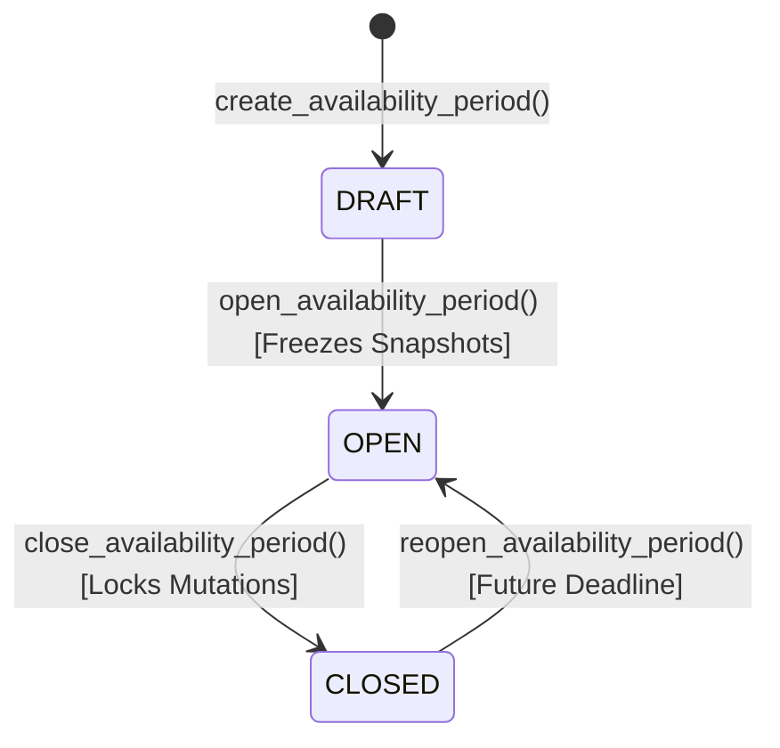

# Weekly Availability Architecture, Lifecycle & Matrix

## Overview
The YellowShifts Availability system manages the complete lifecycle of operational availability collection, submission validation, and real-time manager oversight across Hebrew RTL and English LTR environments.

---

## Availability Period Lifecycle

### 1. Creation (`DRAFT`)
- Created with `p_week_start_date` that strictly aligns with the station's configured `week_start` (0 = Sunday, 1 = Monday, etc.).
- Requires a future submission deadline.

### 2. Opening (`OPEN`) & Atomic Snapshot Freeze
- Transitioning to `OPEN` takes an immediate `FOR UPDATE` lock on the period row.
- Freezes live active shift templates into `availability_period_shift_templates` (names, times, codes, ordering).
- Freezes active station memberships into `availability_period_members`.
- Subsequent edits/renames to live shift templates do not alter historical requirements or calculations.

### 3. Employee Availability Submission
- **3-State Model**:
  - `AVAILABLE` (`is_available = true`)
  - `UNAVAILABLE` (`is_available = false`)
  - `UNANSWERED` (No entry row / `null`)
  - *Note*: False is never conflated with missing/null.
- **Dynamic Completeness**:
  - Enforces: $\text{Required Slots} = \text{Count(Snapshotted Templates)} \times 7$.
  - Incomplete submissions are rejected with error code `P0004`.
- **Edit After Submit Auto-Reversion**:
  - While a period is `OPEN` and prior to the deadline, editing any slot reverts the submission status to `DRAFT` and resets `submitted_at = NULL`.

### 4. Closing & Lockout (`CLOSED`)
- When closed or when the deadline has passed, direct table mutations and RPC calls (`save_availability_draft`, `submit_availability`) are strictly rejected.

---

## Management Matrix & KPI Invariants

The `get_availability_matrix` RPC computes real-time aggregates and per-employee slot matrices with verified invariants:

$$\text{eligibleEmployees} = \text{submittedEmployees} + \text{draftEmployees} + \text{notStartedEmployees}$$
$$\text{notSubmittedEmployees} = \text{draftEmployees} + \text{notStartedEmployees}$$

### Search & Filtering
- Search sanitization prevents SQL wildcard surprises and supports English, Hebrew, employee codes, and special characters.
- Filters allow slicing by status (`ALL`, `SUBMITTED`, `DRAFT`, `NOT_STARTED`) and roles without corrupting global period KPI metrics.

---

## Responsive Visual UX Matrix
- **Mobile (`Compact: 320px - 430px`)**: Unified vertical scroll with summary card, KPI 2x2 grid, filter chips, search bar, and tactile member cards.
- **Tablet (`Medium: 600px - 820px`)**: High density layout with full KPI metric header.
- **Desktop (`Expanded: 1024px - 1600px`)**: Dual-axis scrollable data grid with sticky employee identity and sticky slot headers.
