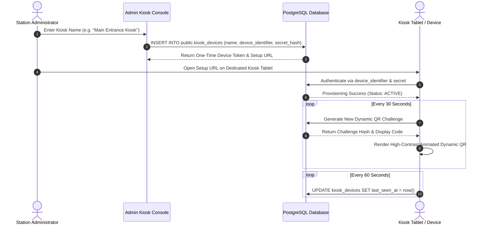

# YellowShifts — Kiosk Provisioning, Operations & Security Guide

## 1. Overview & Threat Model

Kiosks in YellowShifts operate as dedicated station devices stationed at physical entrances. Because physical kiosks are accessible to unauthorized individuals, they are treated as **semi-trusted clients**:

1. **No Long-Lived Administrative Tokens**: Kiosk devices authenticate using a unique `device_identifier` and securely hashed `secret_hash` (Bcrypt-hashed on the database, never stored in plaintext).
2. **Server-Authoritative Dynamic QR Broadcasts**: Kiosks broadcast rotating dynamic QR presence challenges valid for strictly 30 seconds.
3. **Replay & Screenshot Defenses**: Challenge hashes are stored in `public.kiosk_qr_challenges` with unique constraints; once expired or consumed, replay attempts are rejected by the server.
4. **Zero GPS Dependency**: Physical presence is proven cryptographically through proximity to the kiosk display, eliminating GPS battery drain, spoofing, or home attendance fraud.

---

## 2. Kiosk Device Provisioning Workflow

---

## 3. Emergency Kiosk Revocation & Incident Response

### Scenario: Kiosk Tablet Physically Stolen or Compromised
1. **Immediate Administrative Deactivation**:
   - Access Station Settings -> Kiosk Devices.
   - Toggle kiosk status to `INACTIVE` (or delete device).
   - Database immediately revokes all pending dynamic QR challenges associated with the kiosk device ID.
2. **Audit Verification**:
   - Inspect `public.audit_logs` for `KIOSK_DEACTIVATED` event.
3. **Re-provisioning**:
   - Mount new tablet hardware and provision a fresh device record with a new identifier and secret hash.
