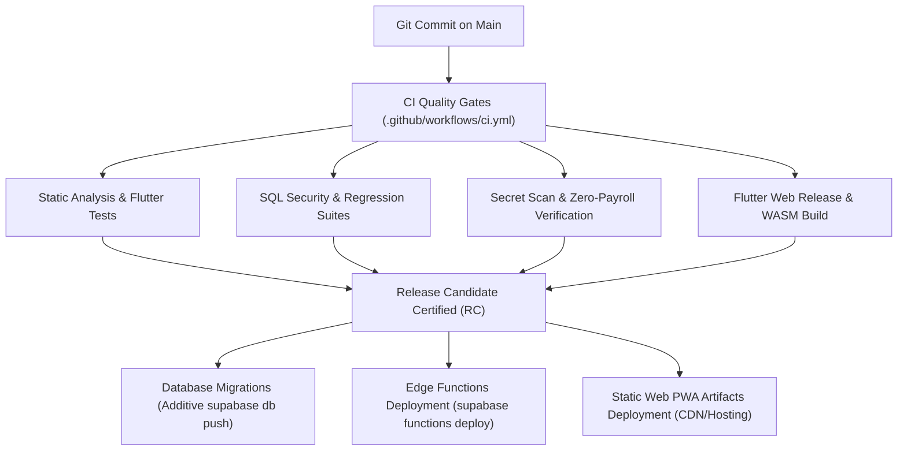

# YellowShifts — Production Deployment & Release Engineering Guide

## 1. Overview & Architecture

YellowShifts is built on a decoupled, multi-station architecture:
- **Client Frontend**: Flutter Web / Progressive Web Application (PWA) compiled to optimized JavaScript and WebAssembly (WASM).
- **Backend Services**: Supabase (PostgreSQL 15+, Supabase Auth, Row-Level Security, Supabase Storage, and Deno Edge Functions).
- **Security Posture**: Fail-closed multi-station tenant isolation enforced at the database level via PostgreSQL RLS and server-authoritative Edge Functions.

---

## 2. Release & Deployment Pipeline



---

## 3. Production Environment Configuration

The application uses compile-time `--dart-define` environment configuration with fail-closed startup validation:

```bash
flutter build web --release \
  --dart-define=SUPABASE_URL=https://<YOUR_PROJECT_ID>.supabase.co \
  --dart-define=SUPABASE_ANON_KEY=<YOUR_PUBLIC_ANON_KEY> \
  --dart-define=APP_ENV=production
```

### Prohibited Secret Policy
- **NO `service_role` keys, database passwords, or private API secrets** may ever be passed to Flutter builds or embedded in client bundles.
- Verified by automated CI scanner: `python3 scripts/audit_bundle_secrets.py`.

---

## 4. Database Deployment Preflight & Application

1. **Preflight Rebuild Check**:
   ```bash
   python3 scripts/restore_drill.py
   ```
2. **List Pending Remote Migrations**:
   ```bash
   supabase migration list
   ```
3. **Deploy Additive Migrations**:
   ```bash
   supabase db push
   ```
4. **Verify Schema Version & Health**:
   ```bash
   curl -s -X POST 'https://<YOUR_PROJECT_ID>.supabase.co/rest/v1/rpc/get_platform_schema_version' \
     -H "apikey: <ANON_KEY>" \
     -H "Content-Type: application/json"
   ```

---

## 5. Edge Function Deployment

All 6 production Edge Functions must be deployed with appropriate JWT verification flags:

```bash
# 1. Employee Management
supabase functions deploy admin-create-employee
supabase functions deploy admin-update-employee
supabase functions deploy admin-reset-password
supabase functions deploy admin-revoke-sessions

# 2. Report Export Generator
supabase functions deploy generate-report-export

# 3. Notification Worker (Worker authorization via service_role/x-cron-secret)
supabase functions deploy process-notification-deliveries --no-verify-jwt
```

---

## 6. Rollback & Forward-Fix Policy

- **Database**: Because database migrations are strictly immutable and additive, database rollbacks MUST be implemented as new forward-fix migrations (e.g. `20260825000018_...`). Destructive operations (`supabase db reset --linked`) are strictly forbidden in production.
- **Client Frontend**: Flutter Web static bundles can be safely rolled back to a previous release on the CDN/hosting layer, provided the deployed backend schema version satisfies `min_compatible_client_version`.
