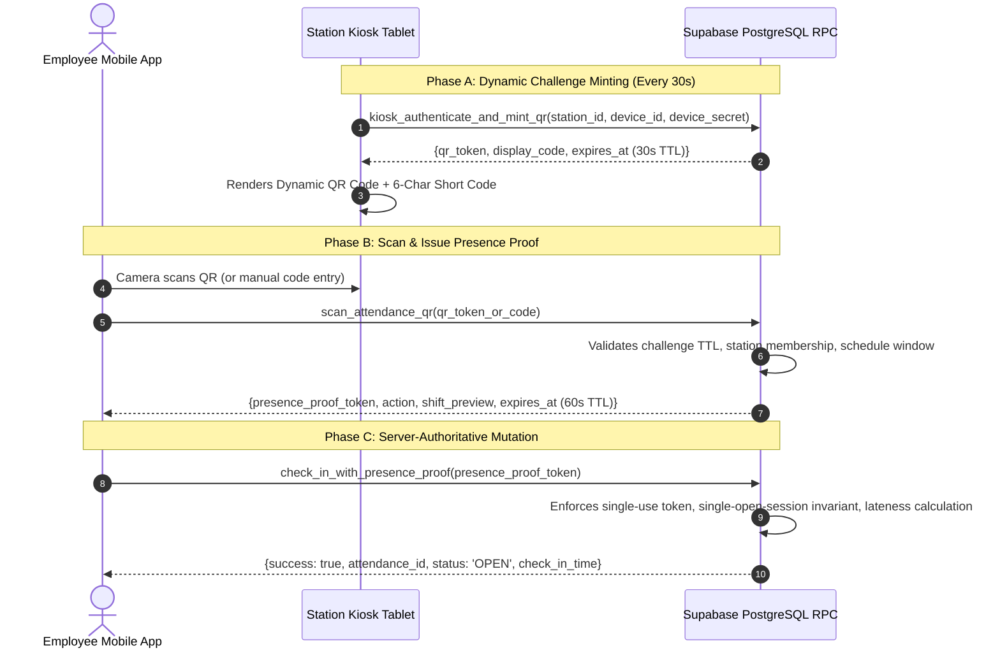

# YellowShifts — Dynamic QR Presence Proof Protocol

## 1. Why Zero GPS Authority?
1. **Physical Accuracy**: Mobile GPS commonly drifts by 15–50 meters in urban, indoor, canopy, or underground convenience store environments, leading to false negatives for legitimate workers.
2. **Device Spoofing**: GPS mock locations and location spoofing apps are trivial on both Android and jailbroken iOS.
3. **Battery & Permissions**: Constant background location tracking drains worker phone batteries and triggers intrusive OS permission prompts.
4. **Physical Station Guarantee**: A worker scanning a physical dynamic kiosk screen positioned at the station counter proves physical optical line-of-sight and physical presence with 100% certainty.

---

## 2. Protocol Flow: Two-Phase Cryptographic Exchange

---

## 3. Cryptographic Invariants & Defenses

### 3.1 30-Second Ephemeral QR Challenge
- **Generation**: Random 32-character hex token + 6-character uppercase short code (`displayCode`).
- **Storage**: Only SHA-256 hash (`challenge_hash`) stored in `kiosk_qr_challenges`.
- **TTL**: 30 seconds.
- **Revocation**: Automatically invalidated when a newer challenge is minted for that kiosk, or upon credential rotation/deactivation.

### 3.2 60-Second Bound Single-Use Presence Proof
- **Generation**: Created atomically upon successful `scan_attendance_qr`.
- **Storage**: Only SHA-256 hash (`token_hash`) stored in `attendance_presence_proofs`.
- **Bindings**:
  - **Employee-Bound**: Tied to `employee_user_id`. Cannot be used by another user (`P0028`).
  - **Action-Bound**: Tied to `action` (`CHECK_IN` vs `CHECK_OUT`). Cannot check out with a check-in proof (`P0029`).
  - **Station-Bound**: Tied to `station_id`. Cannot mutate attendance at a foreign station.
- **Single-Use Replay Defense**: Marked `used_at = now()` atomically on first consumption. Replay attempts fail immediately (`P0026`).
- **TTL**: 60 seconds (`P0027`).

### 3.3 Ephemeral Data Cleanup
Ephemeral challenges and proofs older than 24 hours can be purged automatically via `public.cleanup_ephemeral_attendance_data()`.
